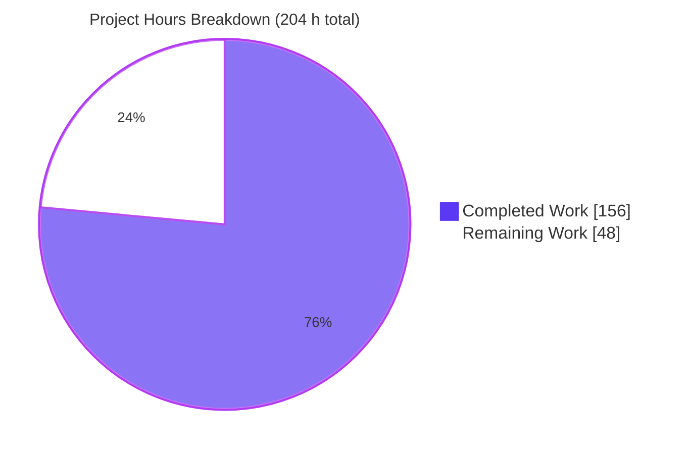
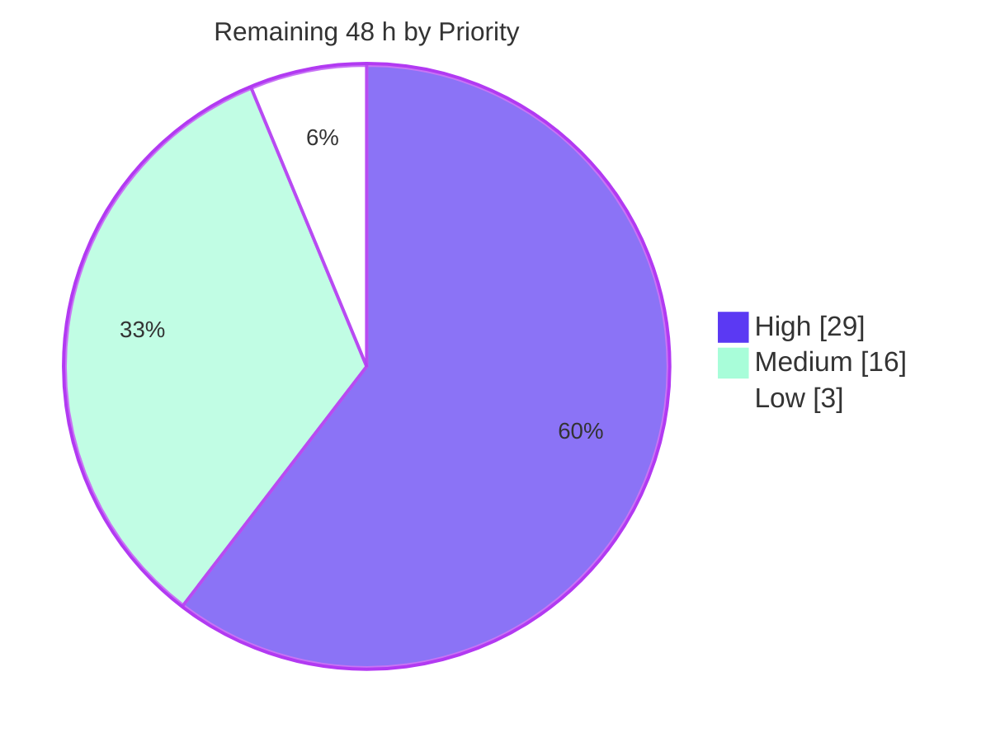
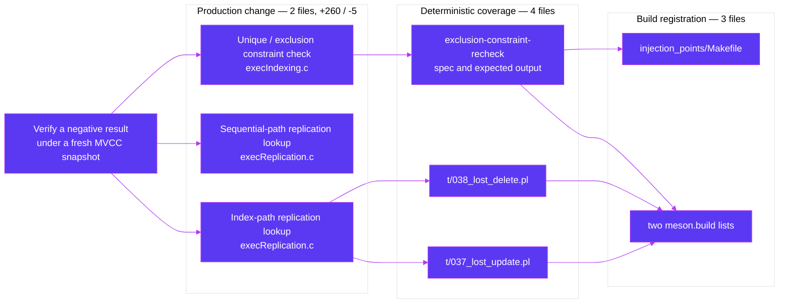

# 1. Executive Summary

## 1.1 Project Overview

This work closes a long-standing concurrency defect in PostgreSQL 19devel. Three relation lookups run under a non-MVCC dirty snapshot and each treats an empty scan result as proof that a row does not exist. When another transaction performs a non-HOT update of that row and commits mid-scan, the scan returns nothing even though the row was live throughout — so a logical replication apply worker silently discards a replicated `UPDATE` or `DELETE`, and a unique or exclusion constraint check reports a false "no conflict". A lost `DELETE` leaves an orphan row that can wedge the subscriber and retain WAL without bound. The fix verifies every negative result once under a fresh MVCC snapshot before any caller may act on it.

## 1.2 Completion Status


| Metric | Value |
|---|---|
| **Total Hours** | **204** |
| Completed Hours (AI + Manual) | **156** (156 AI + 0 Manual) |
| Remaining Hours | **48** |
| **Percent Complete** | **76.5%** |

Calculated as `156 / (156 + 48) × 100 = 76.5%`.

## 1.3 Key Accomplishments

- ✅ Replicated `UPDATE` raced by a committing non-HOT local update converges and reports `update_origin_differs`.
- ✅ Replicated `DELETE` under the same race removes the row, leaving no orphan, and reports `delete_origin_differs`.
- ✅ Unique and exclusion constraint checks no longer return a false "no conflict" while a live matching row exists.
- ✅ Subscription conflict statistics now record the correct conflict type.
- ✅ Genuine missing-row conflicts are still reported unchanged, at their documented severity.
- ✅ Three deterministic tests drive each race by construction and provably fail without the fix.
- ✅ Instrumentation compiles away: a standard build carries zero marker strings and zero related symbols.
- ✅ Every frozen interface untouched — no header, catalog, WAL, protocol or documentation change.

## 1.4 Critical Unresolved Issues

| Issue | Impact | Owner | ETA |
|---|---|---|---|
| Change is not part of upstream PostgreSQL, and the tracked upstream direction for this defect is a different fix shape | Rebasing onto a newer master risks conflict in the two executor files; an upstream commit may prove incompatible | Core / Database engineering | 16 h |
| Sequential `REPLICA IDENTITY FULL` verification has no test that drives its raced miss | A change rendering that path ineffective would pass every suite | Core / Database engineering | 8 h |
| Verification helpers allocate an equality-comparison array per invocation, and the latch re-arms on every tuple-lock retry | Apply-worker memory grows within one message on a wide `REPLICA IDENTITY FULL` relation under sustained contention | Core / Database engineering | 5 h |
| Overhead is established as a bound, not a number | The measuring host's noise floor exceeds the expected worst-case cost, so a small regression could hide inside it | Performance engineering | 4 h |
| Build, suites and measurements were exercised on one platform and one compiler | A platform-specific problem would not yet have surfaced | Release engineering | 8 h |

## 1.5 Access Issues

No access issues identified. Every build, suite and measurement ran with no credential, service account, external endpoint or network access. The changed files read one environment variable, `enable_injection_points`, which both build systems supply.

## 1.6 Recommended Next Steps

1. **[High]** Prepare the patch set against current master, submit it upstream, and work the first review round (16 h).
2. **[High]** Repeat the full suite matrix under a second compiler and one differing architecture (8 h).
3. **[High]** Characterise the verification helpers' per-retry allocation on a wide `REPLICA IDENTITY FULL` relation (5 h).
4. **[Medium]** Close the sequential-path coverage gap with a deterministic two-heap-page test (8 h).
5. **[Medium]** Re-measure overhead on a quiet, dedicated host so cost is a number, not a bound (4 h).

# 2. Project Hours Breakdown

## 2.1 Completed Work Detail

| Component | Hours | Description |
|---|---:|---|
| MVCC verification of negative index-path replication lookups | 18 | `RelationFindReplTupleUnderLatestSnapshot()` plus the marker-hosting scan wrapper, the per-retry latch and the verification block wired into `RelationFindReplTupleByIndex()` (`src/backend/executor/execReplication.c:184-263`, `:396-403`) |
| MVCC verification of negative sequential-path replication lookups | 9 | `RelationFindReplTupleSeqUnderLatestSnapshot()` and its integration into `RelationFindReplTupleSeq()` for `REPLICA IDENTITY FULL` relations with no usable index (`execReplication.c:269-306`, `:577-582`) |
| Skip-detecting constraint scan and snapshot indirection | 15 | `exclusion_getnext_slot()` with its conservative `skippedInvisible` signal, the three new locals, the per-pass reset, the scan indirection through `scanSnapshot`, and `xwait` suppression on the verification pass (`src/backend/executor/execIndexing.c:676-704`, `:862-867`, `:924-926`) |
| Guarded constraint-check verification pass and its guards | 12 | The bounded second pass under a fresh MVCC snapshot with all five guard conjuncts and the paired conditional snapshot pop (`execIndexing.c:1014-1024`) |
| Concurrency design, guard derivation and edge-case resolution | 20 | Root-cause chain, the three guards proven necessary by test, snapshot-stack balance, livelock and interruptibility analysis, and re-derivation of every hunk against this tree's access-method signatures |
| Deterministic replicated UPDATE and DELETE race tests | 19 | `src/test/subscription/t/037_lost_update.pl` and `t/038_lost_delete.pl` — sleep-free marker choreography, structural non-HOT precondition, convergence and conflict-type assertions |
| Deterministic constraint false-negative isolation spec and oracle | 10 | `src/test/modules/injection_points/specs/exclusion-constraint-recheck.spec` and its harness-generated `expected/exclusion-constraint-recheck.out` |
| Test registration across both build systems | 2 | `src/test/subscription/meson.build`, `src/test/modules/injection_points/Makefile` and `meson.build`, with the two isolation lists held in lockstep |
| Negative-control sensitivity proof | 9 | Each of the three tests shown to fail with its predicted symptom when only the verification is excised, and to pass again when restored |
| Full-suite continuity verification | 11 | Core regression, isolation, subscription, injection-point and miscellaneous suites, including the sentinels that assert genuine missing-row conflicts |
| Concurrency stress and observability verification | 15 | Multi-million-operation workloads monitored for conflict types, counters, LSN progress, WAL retention and resource use; the HOT-eligible control experiment; post-run heap and index integrity checks |
| Dual-configuration builds and instrumentation-elision proof | 9 | Warning-fatal builds with the injection-point facility enabled and disabled under both build systems, plus object-level proof that the markers leave no trace |
| In-tree convention and documentation-accuracy conformance | 7 | Indentation, Perl style and lint conformance, and verification of every explanatory comment against the source contract it describes |
| **Total** | **156** | |

## 2.2 Remaining Work Detail

| Category | Hours | Priority |
|---|---:|---|
| Upstream patch-set preparation and rebase onto current master | 6 | High |
| Upstream submission and first review cycle | 10 | High |
| Cross-platform and second-compiler validation | 8 | High |
| Bounded-memory characterisation of the verification helpers and the decision it feeds | 5 | High |
| Deterministic coverage for the sequential-scan miss | 8 | Medium |
| Performance re-measurement on a dedicated host | 4 | Medium |
| Reviewer documentation of the excluded verification boundaries | 4 | Medium |
| Local-carry and rebase-watch policy for the two executor files | 3 | Low |
| **Total** | **48** | |

## 2.3 Hours Reconciliation

| Check | Value |
|---|---|
| Section 2.1 completed total | 156 h |
| Section 2.2 remaining total | 48 h |
| Sum | 204 h — matches Total Hours in Section 1.2 |
| Completion | 156 / 204 × 100 = **76.5%** — matches Sections 1.2, 7 and 8 |

Estimation basis: the two production files carry 260 net-new lines of concurrency logic across two modules, sized against the complex-business-logic band and allocated 18 + 9 hours to the replication paths, 15 + 12 to the constraint path, and 20 to the design work spanning both. Test authoring is 31 hours, approximately 40% of the 74-hour development total. The remaining 51 completed hours are verification across four independent proof layers and four build configurations. Confidence is high on the completed side, where every hour traces to a delivered hunk and an executed test; it is medium on the upstream-review line, which assumes a single review round, and on cross-platform validation, which assumes one additional compiler and one differing architecture.

# 3. Test Results

Every figure below was observed from a run of the suite named, on this branch, in a build with assertions and the injection-point facility enabled.

| Area / Category | Framework | Tests | Passed | Failed | Coverage | What This Proves |
|---|---|---:|---:|---:|---|---|
| Core SQL and executor regression | `pg_regress` | 237 | 237 | 0 | Whole core suite | Ordinary DML, index scans, unique and exclusion constraints are unaffected; `without_overlaps` passing confirms the invalid-TID guard is present and correct |
| Concurrency isolation | `pg_isolation_regress` | 125 | 125 | 0 | Whole isolation suite | Speculative insertion, `ON CONFLICT` races and tuple-locking semantics behave exactly as before |
| Logical replication, full suite | TAP (`prove`) | 568 | 568 | 0 | 39 subscription scripts | Replication apply, conflict classification, statistics, partition routing and `REPLICA IDENTITY FULL` behaviour are unchanged; genuine missing-row conflicts are still raised |
| — of which: dirty-snapshot race, replicated UPDATE and DELETE | TAP (`prove`) | 6 | 6 | 0 | Both raced replication paths | A replicated `UPDATE` or `DELETE` raced by a committing non-HOT local update is applied and converges, and is reported as `*_origin_differs`, never `*_missing` |
| Injection-point module | `pg_regress` + isolation | 9 | 9 | 0 | 4 regression + 5 isolation specs | The new spec runs alongside the four pre-existing ones under both build systems, with identical spec lists |
| — of which: dirty-snapshot race, constraint false negative | `pg_isolation_regress` | 1 | 1 | 0 | `ON CONFLICT` arbiter path | A live conflicting row is still detected when the scan loses it, with the error-mode oracle silent and output byte-identical to the committed expectation |
| Miscellaneous backend behaviour | TAP (`prove`) | 169 | 169 | 0 | 10 scripts | The upsert test that shares the no-conflict marker still reaches it, so the new pass neither suppresses nor delays that signal |
| **Distinct harness tests** | | **1,108** | **1,108** | **0** | | The two indented rows are the gating tests, also run on their own; they are counted once, inside their parent suites |

Four further checks sit outside the harnesses and all four pass: both changed files rebuild warning-free with warnings promoted to errors in the instrumented configuration and again in the standard one, and object inspection of the standard build finds 0 marker strings and 0 related undefined symbols against 1 and 2 in the instrumented build.

Sensitivity was established in both directions. With only the verification blocks removed and the instrumentation left in place, the UPDATE test fails with a spurious `update_missing` and a divergent row, the DELETE test fails with a spurious `delete_missing` and a retained orphan, and the isolation spec fails with the error-mode oracle firing. Restoring the verification returns all three to green, so none of them can pass without the fix.

Beyond the deterministic layer, the raced workloads were driven at volume — several million replicated changes and several million upserts — producing no spurious missing-row conflict and no false-negative constraint check, while the correct `*_origin_differs` conflicts continued to be reported in the hundreds of thousands. A single-variable control with the secondary index removed moved the HOT-update ratio from 0% to over 99%, confirming that a non-HOT update is a necessary precondition for the race rather than an assumption.

**Not covered.** These parts of the delivered change are exercised by no test and should be examined before release:

- **The raced miss on the sequential `REPLICA IDENTITY FULL` path.** The same verification is applied at `execReplication.c:577-582`, and existing coverage confirms the helper still returns a correct negative for a genuinely absent row — but nothing drives its raced miss, so an ineffective sequential verification would not be caught. Provoking it needs a choreographed two-heap-page layout.
- **The per-retry allocation behaviour of the verification helpers.** Each helper allocates its own equality-comparison array (`execReplication.c:247`, `:279`) and the latch re-arms at the retry label, so no test or measurement characterises memory growth for a lookup retried many times inside one apply message on a wide relation.
- **The parallel-mode guard in its firing state.** `!IsInParallelMode()` at `execIndexing.c:1014` is defence in depth; no data-modifying statement observed in this build is planned in parallel mode, so the guard never fires and nothing asserts its behaviour when it does.
- **Platforms other than 64-bit Linux with GCC.** Every suite above ran on one platform and one compiler.

# 4. Runtime Validation &amp; UI Verification

This change has no user-interface surface: it modifies two C files in the executor and adds backend test artefacts. Runtime validation therefore means live clusters, replication flows and observability views. All of the following were driven against running servers built from this branch.

- ✅ **Cluster start-up and extension load** — a publisher and a subscriber both start cleanly with `track_commit_timestamp=on`, `autovacuum=off` and the subscriber preloading the injection-point module; `CREATE EXTENSION injection_points` succeeds and both new marker names attach and detach at runtime.
- ✅ **Subscription creation and initial sync** — publication created, subscription created, replication slot created, and all seeded rows copied to the subscriber.
- ✅ **Replicated UPDATE, raced** — apply worker parked inside the scan window, a local non-HOT `UPDATE` committed while it was parked, then released: the replicated change is applied, the nodes converge, and the conflict is logged as `update_origin_differs` with a `DETAIL` line showing the successor row version.
- ✅ **Replicated DELETE, raced** — same choreography: the row is removed on the subscriber, no orphan remains, and the conflict is logged as `delete_origin_differs`. The publisher then re-inserting that key applies cleanly, so the escalation into a repeating apply error never begins.
- ✅ **`ON CONFLICT` arbiter check, raced** — the upsert visibly waits inside the scan window, the concurrent non-HOT update commits, and the upsert then completes reporting zero rows inserted with the false-negative oracle silent.
- ✅ **`REPLICA IDENTITY FULL` sequential lookup** — on a subscriber table with no index at all, ordinary updates and deletes apply and converge, and genuinely absent rows still report `update_missing` / `delete_missing` with a `replica identity full` detail.
- ✅ **Partition-routed apply and cross-partition movement** — raced updates and deletes on a partitioned subscriber apply correctly, a raced row movement lands in the right partition with nothing left behind, and no duplicate or orphan rows result.
- ✅ **Observability** — `pg_stat_subscription_stats` conflict counters agree exactly with the server log in both directions, `apply_error_count` stays at zero, `pg_stat_replication` reports `streaming`, `confirmed_flush_lsn` advances to the publisher's current WAL position, and retained WAL stays flat and is released promptly after a deliberate subscriber outage.
- ✅ **Resilience** — cancelling a parked backend returns a query-cancelled error; terminating a parked apply worker relaunches it and the change is re-applied with no divergence; an abrupt subscriber crash mid-apply recovers, catches up and converges.
- ⚠ **Parallel-mode data modification** — never exercised at runtime. No data-modifying statement observed in this build is planned in parallel mode, so the parallel-mode guard was never reached; it remains defence in depth rather than a verified branch.

# 5. Compliance &amp; Quality Review

## 5.1 Compliance Matrix

| # | Deliverable / Benchmark | Status | Verified By | Progress |
|---|---|---|---|---|
| 1 | Negative index-path replication lookup verified under a fresh MVCC snapshot | ✅ Pass | `execReplication.c:225-263`, `:396-403`; `t/037_lost_update.pl`, `t/038_lost_delete.pl` | 100% |
| 2 | Negative sequential-path replication lookup verified under a fresh MVCC snapshot | ✅ Pass | `execReplication.c:269-306`, `:577-582`; genuine-absence coverage in `t/001_rep_changes.pl` | 100% |
| 3 | Constraint check verifies an untrusted negative result exactly once, with all five guards | ✅ Pass | `execIndexing.c:676-704`, `:1014-1024`; `exclusion-constraint-recheck` spec | 100% |
| 4 | Dirty-snapshot first pass, `xwait` computation, transaction waits and tuple locking preserved | ✅ Pass | In-progress-writer waits and speculative insertion driven live; isolation suite 125/125 | 100% |
| 5 | Genuine missing-row conflicts still reported at their documented severity | ✅ Pass | `t/001_rep_changes.pl` and `t/013_partition.pl` still log genuine `*_missing` conflicts | 100% |
| 6 | Three deterministic tests present, registered and sensitive to the fix | ✅ Pass | 6 TAP assertions plus 1 isolation spec, all green; excision makes all three fail | 100% |
| 7 | Test registration in both build systems, with identical isolation spec lists | ✅ Pass | `subscription/meson.build`, `injection_points/{Makefile,meson.build}` | 100% |
| 8 | No existing test, assertion or expected-output file modified | ✅ Pass | Empty diff across `src/test/regress/`, the pre-existing subscription scripts and all legacy expected files | 100% |
| 9 | Boundary interfaces frozen — headers, catalogs, WAL, protocol, docs, shared scan code | ✅ Pass | Empty diff across `src/include/`, `src/backend/access/`, `src/backend/replication/`, `doc/`, `configure.ac` | 100% |
| 10 | Warning-free builds with warnings fatal, facility enabled and disabled | ✅ Pass | Both changed files rebuilt with `-Werror` in both configurations, zero diagnostics | 100% |
| 11 | Instrumentation provably compiles away in a standard build | ✅ Pass | Disabled build: 0 marker strings, 0 related undefined symbols; enabled build: 1 and 2 | 100% |
| 12 | Cost reported as an absolute measurement | ⚠ Partial | Throughput and CPU measured on the negative-lookup path and the row-found path | 80% |

## 5.2 AAP &amp; Rule Divergences and Gaps

No user-specified rules exist for this project, so every divergence below is against the plan. Six were established.

| # | What the Plan Required | What Was Delivered Instead | Why It Diverged | Impact | Remediation |
|---|---|---|---|---|---|
| 1 | A frozen comment stating the invalid-TID guard covers the `ON CONFLICT` arbiter check *and* the logical replication conflict check | A comment naming the arbiter check only, and stating that the post-insert exclusion check and the apply-side conflict insert keep historical behaviour (`execIndexing.c:1005-1012`) | The frozen wording contradicted the plan's own scope boundaries, and the code settles it | None functional — the guard itself is byte-identical | None required (Sanctioned) |
| 2 | Explanatory comments reproduced verbatim | Four comments worded differently from the frozen text: skip-signal semantics, disabled-macro behaviour, `xwait` rationale, one re-wrap | Each frozen claim was contradicted by the source contract it described | Documentation only | None required (Sanctioned) |
| 3 | Deterministic coverage for all three manifestations the change addresses | Two of three: no test drives the raced miss on the sequential path | The plan itself declined it as disproportionate — it needs a choreographed two-heap-page layout | An ineffective sequential verification would pass every suite | 8 h — Section 2.2 |
| 4 | Verification of untrusted negative constraint results | Verification confined to callers passing an invalid TID | A fresh MVCC snapshot is unsound where the current command has already written | Post-insert exclusion and apply-side insert keep the historical exposure | 4 h — Section 2.2 |
| 5 | Self-contained, single-exit verification helpers | Delivered verbatim — each helper owns its equality-comparison array | Required shape; the memory consequence is inherent to it | Apply-worker memory grows per retry within one message on wide relations | 5 h — Section 2.2 |
| 6 | Cost reported as an absolute measurement | Cost established as a bound, not a number | The measuring host's resolvable noise floor exceeds the expected worst case | The cost claim cannot be tightened without re-measurement | 4 h — Section 2.2 |

**1 — Guard rationale names a narrower caller set.** The plan froze a comment asserting that the `!ItemPointerIsValid(tupleid)` guard admits both the `ON CONFLICT` arbiter check and the logical replication conflict check, while its own scope boundaries state the apply-side conflict insert is gated *out* of verification. The code decides it: `FindConflictTuple()` passes `&slot->tts_tid` after inserting its own tuple, so that TID is valid and the guard excludes it. The delivered comment at `execIndexing.c:1005-1012` therefore names the arbiter check and records that valid-TID callers retain historical behaviour. The executable guard is unchanged, so there is no functional effect; the value is that a future maintainer cannot widen the guard on a false premise.

**2 — Four comments differ from the frozen wording.** The plan required its comments verbatim, and four claims did not survive checking against this tree. `skippedInvisible` is set whenever a heap fetch exhausts an index TID without returning another visible tuple, including an exhausted HOT-chain continuation — so it is a conservative signal that a negative result may need verification, not proof that an entry was invisible (`execIndexing.c:666-674`). The disabled marker macro reduces to a void use of its name rather than to nothing. The `xwait` rationale reads the dirty snapshot's output fields, which the MVCC pass never updates (`execIndexing.c:919-926`). One comment is re-wrapped to stay canonical under the project's indentation tool. No code differs.

**3 — No deterministic test for the raced sequential miss.** The plan applies the same verification to the `REPLICA IDENTITY FULL` sequential lookup (`execReplication.c:577-582`) but explicitly declines a deterministic test for it, because provoking the race means choreographing a two-heap-page layout so the scan caches the page holding the old version before the successor lands elsewhere. Existing coverage does exercise the helper on the genuine-absence side, so a helper that wrongly reported "found" would be caught; a helper that silently stopped verifying would not. The gap is real and a reviewer is likely to ask for it, so it carries eight hours in the remaining work rather than being closed by argument.

**4 — Verification excluded from valid-TID callers.** Verification runs only where the current command has not yet modified anything. A fresh snapshot carries the current command id, so on a post-insert check a row version this very command superseded still satisfies MVCC visibility and would conflict with its own successor — temporal primary keys in `without_overlaps` demonstrate exactly that, and its passing is the standing evidence that the guard is intact. The apply-side conflict insert is separately protected: the worker already holds an uncommitted index entry for the key, so a concurrent writer must block on its transaction before committing. Both paths keep the historical exposure; the decision needs documenting for reviewers.

**5 — Helpers own their equality-comparison array.** The required shape is a self-contained, single-exit helper so no caller jump can cross the snapshot push and pop, and that is what shipped. Each helper therefore allocates its own array — conditionally on the index path (`execReplication.c:247`), unconditionally on the sequential path (`:279`) — and because the latch re-arms at the retry label, a lookup retried repeatedly inside one apply message allocates one array per retry in a context released only at the message boundary. On a very wide `REPLICA IDENTITY FULL` relation that is roughly ten kilobytes per retry. Growth is bounded by the message, but the shipped shape is uncharacterised; five hours are allocated to measure it and decide.

**6 — Cost is a bound rather than a number.** The plan asks for cost as an absolute measurement, and one was taken: a paired comparison against an identically instrumented build with only the verification removed, over dozens of repetitions and millions of applied changes, showing no measurable penalty on the negative-lookup path and none at all on the row-found path. The difficulty is the instrument, not the result — the measuring host is shared and many-core, and its resolvable noise floor is wider than the worst-case overhead the plan predicted, so the prediction could only be confirmed as not exceeded. Four hours on a quiet dedicated host would turn the bound into a figure.

# 6. Risk Assessment

| Risk | Category | Severity | Probability | Mitigation | Status |
|---|---|---|---|---|---|
| The change is not part of upstream PostgreSQL, and the tracked upstream direction for this defect is a different fix shape, so a future rebase may conflict in the two executor files or an upstream commit may prove structurally incompatible | Technical | High | High | Submit the patch set for review; keep a rebase watch on `src/backend/executor/execReplication.c` and `execIndexing.c`; settle the local-carry policy before rollout | Open |
| Sequential `REPLICA IDENTITY FULL` verification (`execReplication.c:577-582`) is exercised only on the genuine-absence side, so a change that renders it ineffective would pass every suite | Technical | Medium | Medium | Add the two-heap-page deterministic test; treat that helper as change-sensitive in review | Open |
| Each verification helper allocates its own equality-comparison array and the latch re-arms per tuple-lock retry, so apply-worker memory grows within one message on a wide `REPLICA IDENTITY FULL` relation under sustained local contention | Technical | Medium | Low | Characterise the growth, then either free on exit or give the caller ownership of the array; growth is bounded by the apply message | Open |
| Verification is deliberately confined to callers passing an invalid TID, so the post-insert exclusion check and the apply-side conflict insert retain the historical false-negative exposure | Technical | Medium | Low | `without_overlaps` is the standing detector against widening the guard; re-examine the apply-side insert if its uncommitted-index-entry protection ever changes | Accepted |
| The two new markers can park a backend indefinitely in wait mode, so a build shipping with the injection-point facility enabled would hand anyone able to attach a marker a denial-of-service primitive | Security | Low | Low | Never enable the injection-point facility in a production build; object inspection confirms a standard build carries zero marker strings and zero related symbols, confining the risk to deliberately instrumented builds | Mitigated |
| All three race tests skip unless the injection-point facility is compiled in, so a standard packaging or CI pipeline gets no coverage of these races and a future regression could ship unnoticed | Operational | Medium | Medium | Run at least one CI lane with assertions and the injection-point facility enabled | Open |
| Builds, suites and measurements were exercised on one platform, one compiler and a shared measurement host, so cost is a bound rather than a number and a platform-specific problem would not yet have surfaced | Operational | Medium | Low | Repeat the suites under a second compiler and one differing architecture; re-measure on a quiet dedicated host before rolling out to a latency-sensitive subscriber | Open |
| Conflict accounting legitimately changes meaning: events previously counted as `confl_update_missing` / `confl_delete_missing` are now counted as `confl_update_origin_differs` / `confl_delete_origin_differs`, so dashboards and alerts keyed to the missing-row counters will step-change at rollout | Integration | Low | High | Re-baseline subscription-conflict dashboards and alert thresholds when the build is deployed; this is the intended repair of a mis-accounting, not a defect | Open |

# 7. Visual Project Status

**Overall progress — 76.5% complete.** Completed work is shown in Blitzy Dark Blue (`#5B39F3`); remaining work in White (`#FFFFFF`).



**Remaining work by priority** — High 29 h, Medium 16 h, Low 3 h.



**Remaining hours per category** (Section 2.2):

| Category | Hours | Share of the 48 h |
|---|---:|---|
| Upstream submission and first review cycle | 10 | ████████████████████ 20.8% |
| Cross-platform and second-compiler validation | 8 | ████████████████ 16.7% |
| Deterministic coverage for the sequential-scan miss | 8 | ████████████████ 16.7% |
| Upstream patch-set preparation and rebase | 6 | ████████████ 12.5% |
| Bounded-memory characterisation and its decision | 5 | ██████████ 10.4% |
| Performance re-measurement on a dedicated host | 4 | ████████ 8.3% |
| Reviewer documentation of the excluded boundaries | 4 | ████████ 8.3% |
| Local-carry and rebase-watch policy | 3 | ██████ 6.3% |
| **Total** | **48** | **100%** |

**Delivered scope by capability** — nine files, 729 lines added, 6 removed.



# 8. Summary &amp; Recommendations

**What was delivered.** Three relation lookups that run under a non-MVCC dirty snapshot no longer treat an empty scan result as proof of absence. Each now verifies a negative result exactly once under a fresh MVCC snapshot before any caller may act on it — a snapshot that cannot lose a row which was live when it was taken. The existing dirty-snapshot pass is preserved byte for byte, so the apply worker still sees and waits for uncommitted inserters of the same key, and the whole wait-then-retry recovery works exactly as before. The change is nine files: two executor sources carrying 260 net-new lines, three one-line build registrations, and four new test artefacts. Nothing else moved. No public signature, header, catalog definition, WAL record, wire protocol or documentation file was touched, and no existing test, assertion or expected-output file was edited.

**What was verified.** The three behaviours the change corrects were each driven by construction, not by chance: the scan is parked inside the exact race window, a concurrent non-HOT update commits while it waits, and the scan is then released. Under that interleaving a replicated `UPDATE` converges, a replicated `DELETE` removes the row with no orphan, and a constraint check still finds the live conflicting row — and each is reported with the correct conflict type, which also repairs the subscription statistics that were previously mis-attributed. Every one of those tests provably fails when only the verification is removed and passes again when it is restored, so none of them can be satisfied by an unfixed tree. Around them, 1,108 tests pass across the core, isolation, replication, injection-point and miscellaneous suites, including the sentinels that assert genuine missing-row conflicts are still raised at their documented severity, and the temporal primary-key case that stands guard over the one place verification must not run. Both changed files compile warning-free with warnings promoted to errors in both the instrumented and the standard configuration, and the test instrumentation is proven at object level to leave no trace in a standard build.

**What remains, and the critical path.** At **76.5% complete**, the code is done and the correctness case is made; what is left is the path from a verified branch to something an operator deploys with confidence. The critical path is upstream: this fix is not part of PostgreSQL, the community's tracked direction for the same defect is a different shape, and until that is settled every rebase carries conflict risk in two executor files. Sixteen hours prepare and submit the patch set and work the first review round, and the argument for the chosen shape is already in hand — swapping the dirty snapshot outright would stop the apply worker waiting for a not-yet-committed local insert of the same key, introducing a new convergence failure of the very family being addressed. In parallel, eight hours repeat the suite matrix under a second compiler and a differing architecture, and five hours characterise how much memory the verification helpers accumulate when a lookup retries repeatedly inside one apply message on a very wide relation.

**Gaps a reader should weigh.** Three are worth knowing before release. The raced miss on the sequential `REPLICA IDENTITY FULL` path has no test that drives it, so an ineffective verification there would go unnoticed — eight hours closes it. Verification is deliberately withheld from callers that have already modified the heap in the current command, because a fresh snapshot would make a superseded row version conflict with its own successor; those paths keep their historical exposure and the reasoning needs writing down for reviewers. And the overhead figure is a bound rather than a number, because the measuring host's resolvable noise floor is wider than the cost being measured; four hours on a quiet machine settles it. Separately, at rollout the subscription conflict counters will step-change as events move from the missing-row counters to the origin-differs counters — that is the mis-accounting being repaired, but any dashboard keyed to the old counters needs re-baselining.

**Production readiness.** Recommendation: **ready for staging, hold general rollout until the cross-platform run and the memory characterisation are complete.** The defect it removes is severe — a single silently dropped `DELETE` can leave an orphan row that later wedges a subscriber and retains WAL without bound — and the fix is narrow, guarded, reversible, and demonstrably neutral on every path that works today. The remaining 48 hours are not about whether the fix is correct; they are about the breadth of platform evidence, the durability of carrying a core patch outside upstream, and two measurements that deserve to be numbers rather than bounds.

# 9. Development Guide

### 9.1 System Prerequisites

**Two hard requirements before anything else.**

1. **Never build or test as root.** `initdb`, the postmaster, `pg_regress` and the TAP harness all refuse to run as a privileged user. Use an unprivileged account that owns the checkout, and register the checkout as a safe git directory for that account.
2. **`/dev/shm` must be at least 2 GB.** The POSIX shared-memory tests fail below that. As root: `mount -o remount,size=2G /dev/shm`. Re-apply after any container restart.

Required packages (Ubuntu 25.10 names; versions are what this branch was built and tested with):

```bash
sudo apt-get update && sudo DEBIAN_FRONTEND=noninteractive apt-get install -y \
    build-essential bison flex pkg-config \
    libreadline-dev zlib1g-dev libicu-dev libxml2-dev \
    libipc-run-perl \
    meson ninja-build ccache
```

`libipc-run-perl` is not optional — `--enable-tap-tests` requires it. `perltidy` and `libperl-critic-perl` are needed only for the read-only lint checks in §9.5.

### 9.2 Environment Setup

No environment variables, secrets or credentials are required by the project itself. The changed files read exactly one variable, `enable_injection_points`, and both build systems set it for you. The three shell variables below exist only so the commands in this guide are copy-pasteable; point them anywhere you like.

```bash
# Run everything as the unprivileged owner of the checkout.
export REPO="$PWD"                       # the checkout you are working in
export PGPREFIX="$HOME/pg-install"       # install prefix for this build
export PGRIG="$HOME/pg-rig"              # scratch data directories for §9.6

cd "$REPO"
git status --porcelain          # expect no output
git log --oneline -1
```

### 9.3 Build and Install

Configure once, in the tree. Assertions and the injection-point facility are what make the three new tests runnable; `-Werror` is how the zero-warning requirement is enforced.

```bash
cd "$REPO"

./configure --prefix="$PGPREFIX" \
            --enable-cassert --enable-debug \
            --enable-tap-tests --enable-injection-points \
            --with-icu --with-libxml

make -j4 COPT=-Werror world-bin        # expect exit 0 and zero warnings
make -j4 install-world-bin
make install -C src/test/modules/injection_points
```

Confirm the configuration actually took effect:

```bash
grep -E 'USE_INJECTION_POINTS|USE_ASSERT_CHECKING' src/include/pg_config.h
# #define USE_ASSERT_CHECKING 1
# #define USE_INJECTION_POINTS 1

"$PGPREFIX"/bin/postgres --version      # postgres (PostgreSQL) 19devel
"$PGPREFIX"/bin/pg_config --configure   # echoes the seven options above
```

**Do not run `configure` a second time in this tree, and do not attempt a VPATH or Meson build from it.** PostgreSQL refuses `meson setup` in a directory that already holds an in-tree autoconf build. Export a fresh copy instead:

```bash
export PGOTHER="$HOME/pg-other"
mkdir -p "$PGOTHER" && git archive HEAD | tar -x -C "$PGOTHER"
cd "$PGOTHER" && ./configure --prefix="$HOME/pg-other-install" ...
```

Dependency tracking is off in this tree (there is no `.deps`), so a header-only change is not picked up automatically. When in doubt, `make clean -C <directory>` before rebuilding. To force a rebuild of just the two changed files, name the objects explicitly — the directory's default target is satisfied by the existing object list:

```bash
cd "$REPO/src/backend/executor"
rm -f execReplication.o execIndexing.o
make COPT=-Werror execReplication.o execIndexing.o
# the gcc lines must show '-g -O2 -Werror'; expect zero warnings
```

### 9.4 Verification

Each suite provisions and tears down its own temporary cluster; there is no database to create. Prefix every invocation with a generous timeout.

```bash
cd "$REPO"
export PG_TEST_TIMEOUT_DEFAULT=600

# The three tests that gate this change
PROVE_TESTS='t/037_lost_update.pl t/038_lost_delete.pl' \
  make -C src/test/subscription check          # Files=2, Tests=6, Result: PASS
make -C src/test/modules/injection_points check # regress 4/4, isolation 5/5

# Continuity
make -C src/test/regress check                 # All 237 tests passed
make -C src/test/isolation check                # All 125 tests passed
make -C src/test/subscription check             # Files=39, Tests=568, PASS
make -C src/test/modules/test_misc check        # Files=10, Tests=169, PASS
```

Run a single isolation spec on its own while iterating:

```bash
make -C src/test/modules/injection_points check \
     REGRESS= ISOLATION=exclusion-constraint-recheck
# ok 1 - exclusion-constraint-recheck
```

Confirm the raced conflicts were classified correctly, not merely that the tests passed:

```bash
cd "$REPO"
L=src/test/subscription/tmp_check/log
grep -c 'conflict=update_origin_differs' $L/037_lost_update_subscriber.log   # 1
grep -c 'conflict=update_missing'        $L/037_lost_update_subscriber.log   # 0
grep -c 'conflict=delete_origin_differs' $L/038_lost_delete_subscriber.log   # 1
grep -c 'conflict=delete_missing'        $L/038_lost_delete_subscriber.log   # 0
```

**Prove the instrumentation costs nothing in a standard build.** Configure a separate tree without the facility, then inspect the objects:

```bash
export PGSTD="$HOME/pg-standard"
mkdir -p "$PGSTD" && (cd "$REPO" && git archive HEAD) | tar -x -C "$PGSTD"
cd "$PGSTD"
./configure --prefix="$HOME/pg-standard-install" \
            --enable-cassert --enable-debug --enable-tap-tests
grep USE_INJECTION_POINTS src/include/pg_config.h   # /* #undef USE_INJECTION_POINTS */
make -j4 COPT=-Werror                                # exit 0, zero warnings

strings src/backend/executor/execReplication.o | grep -c 'before-heap-fetch'   # 0
strings src/backend/executor/execIndexing.o    | grep -c 'constraint-'         # 0
nm -u src/backend/executor/exec{Replication,Indexing}.o | grep -ci injection    # 0
```

The instrumented build shows `1`, `2` and `2` for the same three commands. In the facility-less tree the module check skips cleanly rather than failing:

```bash
make -C src/test/modules/injection_points check
# injection points are disabled in this build   (exit 0)
```

### 9.5 Read-Only Lint

```bash
cd "$REPO"
src/tools/pgindent/pgindent --check \
    --indent=src/tools/pg_bsd_indent/pg_bsd_indent \
    --typedefs=src/tools/pgindent/typedefs.list \
    src/backend/executor/execReplication.c src/backend/executor/execIndexing.c
# exit 0, no hunks

perlcritic --profile src/tools/perlcheck/perlcriticrc \
    src/test/subscription/t/037_lost_update.pl src/test/subscription/t/038_lost_delete.pl
# 'source OK' for each

PERL5LIB=src/test/perl perl -c src/test/subscription/t/037_lost_update.pl   # syntax OK
```

`pg_bsd_indent` is built by the tree; if `pgindent` cannot find it, build it with `make -C src/tools/pg_bsd_indent`.

### 9.6 Example Usage — Observing the Behaviour by Hand

A two-node rig reproduces the conditions the fix addresses. The **subscriber-only indexed column is essential**: it forces the concurrent local update to be non-HOT, and without it the race cannot occur at all.

```bash
export PATH="$PGPREFIX/bin:$PATH"
rm -rf "$PGRIG" && mkdir -p "$PGRIG"

initdb -D "$PGRIG/pub" -A trust --no-sync -U postgres
initdb -D "$PGRIG/sub" -A trust --no-sync -U postgres

cat >> "$PGRIG/pub/postgresql.conf" <<'EOF'
port=55432
wal_level=logical
track_commit_timestamp=on
autovacuum=off
EOF

cat >> "$PGRIG/sub/postgresql.conf" <<'EOF'
port=55433
track_commit_timestamp=on
autovacuum=off
shared_preload_libraries=injection_points
EOF

pg_ctl -D "$PGRIG/pub" -l "$PGRIG/pub.log" -w start
pg_ctl -D "$PGRIG/sub" -l "$PGRIG/sub.log" -w start
```

```sql
-- publisher, port 55432
CREATE TABLE conf_tab(a int PRIMARY KEY, data text);
INSERT INTO conf_tab SELECT g, 'orig' FROM generate_series(1,10) g;
CREATE PUBLICATION pub FOR TABLE conf_tab;

-- subscriber, port 55433
CREATE EXTENSION injection_points;
CREATE TABLE conf_tab(a int PRIMARY KEY, data text, i int DEFAULT 0);
CREATE INDEX i_index ON conf_tab(i);   -- forces the local UPDATE to be non-HOT
CREATE SUBSCRIPTION sub
    CONNECTION 'port=55432 dbname=postgres user=postgres' PUBLICATION pub;
```

Then drive the race and read the result:

```bash
# park the apply worker inside the scan window
psql -p 55433 -U postgres -c \
  "SELECT injection_points_attach('find-repl-tuple-by-index-before-heap-fetch','wait');"

psql -p 55432 -U postgres -c "UPDATE conf_tab SET data='frompub' WHERE a=3;"

# wait until the worker is parked, then commit a non-HOT local update
psql -p 55433 -U postgres -c \
  "SELECT wait_event FROM pg_stat_activity WHERE backend_type='logical replication apply worker';"
psql -p 55433 -U postgres -c "UPDATE conf_tab SET i = i + 1 WHERE a = 3;"

# release it
psql -p 55433 -U postgres -c \
  "SELECT injection_points_detach('find-repl-tuple-by-index-before-heap-fetch');
   SELECT injection_points_wakeup('find-repl-tuple-by-index-before-heap-fetch');"

# expected: the value replicated, and the conflict typed correctly
psql -p 55433 -U postgres -tAc "SELECT data FROM conf_tab WHERE a=3;"        # frompub
grep -c 'conflict=update_origin_differs' "$PGRIG/sub.log"                     # 1
grep -c 'conflict=update_missing'        "$PGRIG/sub.log"                     # 0
psql -p 55433 -U postgres -c \
  "SELECT apply_error_count, confl_update_missing, confl_update_origin_differs
     FROM pg_stat_subscription_stats;"

pg_ctl -D "$PGRIG/sub" -m fast -w stop && pg_ctl -D "$PGRIG/pub" -m fast -w stop
```

Without the fix, the same sequence logs `conflict=update_missing`, leaves `data` at `orig`, and the two nodes diverge.

### 9.7 Troubleshooting

| Symptom | Cause | Resolution |
|---|---|---|
| `initdb: cannot be run as root`, or `pg_regress` refuses to start a temp instance | Running as a privileged user | Re-run as the unprivileged owner of the checkout |
| POSIX shared-memory tests fail while everything else passes | `/dev/shm` smaller than 2 GB | `mount -o remount,size=2G /dev/shm` as root |
| `t/037_lost_update.pl .. skipped: Injection points not supported by this build` | Tree configured without `--enable-injection-points` | A skip is correct, not a failure. Re-configure with the facility to exercise the races |
| `injection points are disabled in this build` from the module check | Same cause | Same conclusion — the disabled path is exercised deliberately |
| `ERROR: extension "injection_points" is not available` | Module built but not installed | `make install -C src/test/modules/injection_points` |
| `meson setup` refuses, or a VPATH build fails | The tree already holds an in-tree autoconf build | Export a fresh copy with `git archive HEAD \| tar -x -C <dir>` and configure that |
| Deleting an object then running `make` in `src/backend/executor` appears to do nothing | The directory's default target is satisfied by the existing object list | Name the objects explicitly: `make COPT=-Werror execReplication.o execIndexing.o` |
| A header-only change is not picked up by `make` | Dependency tracking is off in this tree | `make clean -C <directory>` then rebuild |
| The isolation spec hangs instead of completing | The wait-mode marker was woken before being detached, letting the verification pass park a second time | Detach before waking, exactly as the shipped spec does |
| A subscriber stops advancing, `apply_error_count` climbs, retained WAL grows | This is the failure mode the change removes | Check `pg_stat_subscription_stats.apply_error_count` and `pg_replication_slots.confirmed_flush_lsn`; confirm the subscriber is running a build that carries this change |

# 10. Appendices

### A. Command Reference

Shell variables are the ones introduced in §9.2 — set them to whatever locations suit you.

| Purpose | Command |
|---|---|
| Configure (instrumented) | `./configure --prefix="$PGPREFIX" --enable-cassert --enable-debug --enable-tap-tests --enable-injection-points --with-icu --with-libxml` |
| Configure (standard) | `./configure --prefix="$HOME/pg-standard-install" --enable-cassert --enable-debug --enable-tap-tests` |
| Build, warnings fatal | `make -j4 COPT=-Werror world-bin` |
| Install | `make -j4 install-world-bin` |
| Install the injection-point module | `make install -C src/test/modules/injection_points` |
| Rebuild only the changed files | `cd src/backend/executor && make COPT=-Werror execReplication.o execIndexing.o` |
| The three gating tests | `PROVE_TESTS='t/037_lost_update.pl t/038_lost_delete.pl' make -C src/test/subscription check` and `make -C src/test/modules/injection_points check` |
| One isolation spec | `make -C src/test/modules/injection_points check REGRESS= ISOLATION=exclusion-constraint-recheck` |
| Core regression | `make -C src/test/regress check` |
| Isolation | `make -C src/test/isolation check` |
| Full replication suite | `make -C src/test/subscription check` |
| Miscellaneous backend suite | `make -C src/test/modules/test_misc check` |
| Facility-disabled skip check | `make -C src/test/modules/injection_points check enable_injection_points=no` |
| Marker elision check | `strings src/backend/executor/execIndexing.o \| grep -c 'constraint-'` and `nm -u src/backend/executor/exec{Replication,Indexing}.o \| grep -ci injection` |
| Export a clean second tree | `git archive HEAD \| tar -x -C "$PGSTD"` |
| C indentation check | `src/tools/pgindent/pgindent --check --indent=src/tools/pg_bsd_indent/pg_bsd_indent --typedefs=src/tools/pgindent/typedefs.list <files>` |
| Perl lint | `perlcritic --profile src/tools/perlcheck/perlcriticrc <files>` |
| Perl formatting | `perltidy --profile=src/tools/pgindent/perltidyrc <files>` |

Prefix every test invocation with `PG_TEST_TIMEOUT_DEFAULT=600`.

### B. Port Reference

| Port | Used by |
|---|---|
| 5432 | Compiled-in default (`DEF_PGPORT`); not used by the test harness |
| 65432 | Base port the TAP harness passes to its nodes; each node then allocates a free port of its own |
| dynamic | `pg_regress` and `pg_isolation_regress` temporary instances choose a free port per run |
| 55432 / 55433 | Publisher and subscriber in the manual rig of §9.6 — arbitrary, change freely |

No port needs to be opened or reserved: every suite provisions a private cluster on a loopback socket and tears it down again.

### C. Key File Locations

| Path | Role |
|---|---|
| `src/backend/executor/execReplication.c` | Both replication lookups. Marker-hosting scan wrapper at `:184-208`; index-path verification helper at `:225-263`; sequential-path helper at `:269-306`; verification blocks at `:396-403` and `:577-582` |
| `src/backend/executor/execIndexing.c` | Unique and exclusion constraint check. Skip-detecting scan helper at `:676-704`; snapshot indirection and per-pass reset at `:862-867`; `xwait` suppression at `:924-926`; guarded verification pass and paired snapshot pop at `:1014-1024`; pre-existing no-conflict oracle immediately before the return |
| `src/test/subscription/t/037_lost_update.pl` | Deterministic replicated-`UPDATE` race test |
| `src/test/subscription/t/038_lost_delete.pl` | Deterministic replicated-`DELETE` race test |
| `src/test/modules/injection_points/specs/exclusion-constraint-recheck.spec` | Deterministic constraint false-negative isolation spec |
| `src/test/modules/injection_points/expected/exclusion-constraint-recheck.out` | Its expected output — harness-generated, whitespace-significant, never hand-edited |
| `src/test/subscription/meson.build` | Registers the two TAP tests |
| `src/test/modules/injection_points/Makefile` | `ISOLATION` list — registers the spec for the primary build system |
| `src/test/modules/injection_points/meson.build` | Isolation `specs` list — held in lockstep with the `Makefile` |
| `src/test/regress/sql/without_overlaps.sql` | Temporal primary keys. Its passing is the standing evidence that verification is correctly withheld from callers that have already written |
| `src/test/subscription/t/001_rep_changes.pl` | Asserts genuine missing-row conflicts, including on the sequential `REPLICA IDENTITY FULL` path |
| `src/test/modules/test_misc/t/010_index_concurrently_upsert.pl` | Shares the no-conflict marker; confirms the new pass does not suppress it |

### D. Technology Versions

| Component | Version |
|---|---|
| PostgreSQL | 19devel (`configure.ac`, `meson.build`) |
| gcc | 15.2.0 |
| GNU Make | 4.4.1 |
| bison / flex | 3.8.2 / 2.6.4 |
| Perl | 5.40.1, with `IPC::Run` 20231003.0 and `TAP::Harness` 3.48 |
| meson / ninja | 1.7.0 / 1.12.1 |
| ICU | 76.1 |
| libxml2 | 2.14.5 |
| git | 2.51.0 |
| Python | 3.13.7 (build tooling only) |
| Host OS | Ubuntu 25.10, x86-64 |

Build flags in force: `USE_ASSERT_CHECKING`, `USE_INJECTION_POINTS`. Primary build system is autoconf + make; meson is exercised as the secondary.

### E. Environment Variable Reference

| Variable | Set by | Purpose |
|---|---|---|
| `enable_injection_points` | Both build systems, automatically | The only variable the changed files read. `yes` runs the three race tests; `no` makes them skip cleanly |
| `PG_TEST_TIMEOUT_DEFAULT` | You, optionally | Per-wait timeout for the TAP harness. Use `600` on a loaded machine |
| `PROVE_TESTS` | You, optionally | Restricts a TAP suite to named scripts |
| `PROVE_FLAGS` | You, optionally | Passed to `prove`; e.g. `-j3` for parallel scripts |
| `REGRESS` / `ISOLATION` | You, optionally | Restrict a module check to named regression or isolation tests |
| `COPT` | You, on the make line | Extra compiler flags. `-Werror` is required for the zero-warning check |

No secret, credential, connection string or service account is needed anywhere in the build, test or verification flow.

### F. Developer Tools Guide

| Tool | Invocation | Notes |
|---|---|---|
| `pgindent` | See §9.5 | The authoritative C formatter. Never reflow a comment by hand — the tool decides the wrapping, and a line at exactly the column limit will be rewrapped |
| `pg_bsd_indent` | `make -C src/tools/pg_bsd_indent` | `pgindent`'s backend; build it once |
| `perltidy` / `perlcritic` | See §9.5 | Perl formatting and lint, using the in-tree profiles |
| `injection_points` extension | `CREATE EXTENSION injection_points;` | `injection_points_attach(name, mode)` with mode `notice`, `error` or `wait`; `injection_points_wakeup(name)` releases a parked backend; `injection_points_detach(name)`; `injection_points_set_local()` confines attachments to the current backend. Always **detach before waking** if the code under test can reach the same marker twice |
| `pg_stat_activity` | `SELECT wait_event FROM pg_stat_activity WHERE backend_type='logical replication apply worker'` | An injection-point wait surfaces as a wait event named after the marker — the sleep-free way to confirm a backend is parked |
| `pg_stat_subscription_stats` | `SELECT * FROM pg_stat_subscription_stats;` | Conflict counters and `apply_error_count`; the primary check that conflicts are being classified correctly |
| `pg_replication_slots` | `SELECT confirmed_flush_lsn, wal_status FROM pg_replication_slots;` | A frozen `confirmed_flush_lsn` with growing retained WAL is the escalation this change prevents |
| `amcheck` | `bt_index_parent_check(...)`, `verify_heapam(...)` | Post-stress heap and index integrity verification |

### G. Glossary

| Term | Meaning |
|---|---|
| **Dirty snapshot** | A non-MVCC snapshot that can see uncommitted tuples. Used by these lookups so an apply worker can see, and wait for, an in-flight inserter of the same key. Its output fields report a transaction to wait for only while that transaction is still in progress — which is why an updater that has already committed leaves nothing to wait for |
| **MVCC snapshot** | An ordinary snapshot. A tuple live when the snapshot was taken stays visible to it no matter what commits afterwards, which is precisely why it cannot lose the row |
| **HOT update** | An update that fits on the same heap page and changes no indexed column, so no new index entry is needed and the old tuple chains to the new one |
| **Non-HOT update** | An update that must insert a new index entry, breaking that chain. This is a necessary precondition for the race — with the chain intact the scan reaches the successor and nothing is lost |
| **Replica identity** | The column set a subscriber uses to locate the row a replicated change refers to — usually the primary key, or every column under `REPLICA IDENTITY FULL` |
| **`*_origin_differs`** | The conflict reported when the target row exists but was last written by a different origin. The correct outcome under the race this change fixes |
| **`*_missing`** | The conflict reported when the target row genuinely cannot be found. Logged, and the change skipped. Still raised when it is correct |
| **Injection point** | A named, compile-time-optional marker a test can attach to in order to observe, divert or park execution at an exact place. Absent from a standard build |
| **Verification pass** | The single extra scan this change performs under a fresh MVCC snapshot before a negative result is believed. Latched, so it runs at most once per attempt, and skipped entirely whenever the row was found |
| **Negative control** | Removing only the fix, keeping the instrumentation, and confirming each test fails in its predicted way — the proof that a test is sensitive to the fix rather than passing regardless |
